# Lab 1 - Configure and Debug Tenant Call Flows

Please use the following credentials to connect to Control Hub and configure Webex Contact Center:

| <!-- -->         | <!-- -->         |
| ---------------- | ---------------- |
| `Control Hub URL`            | <a href="https://admin.webex.com" target="_blank">https://admin.webex.com</a> |
| `Username`       | wxccemealabs+admin**ID**@gmail.com  _(where **ID** is your assigned pod number; this ID will be provided by your proctor)_ |
| `Password`       | ciscoliveAMER25! |

## Objective 

The objective of this self-paced lab is to provide participants with hands-on experience in configuring and debugging tenant call flows, as well as analyzing agent performance through call reports. This excercise has been divided into three sections

- Section 1: Discover Tenant Call Flow Configuration
This section aims to familiarize participants with the existing call flow configurations within a tenant environment.

- Section 2: Configure and Debug an Inbound Flow
In this part, participants will set up an inbound flow with a whisper announcement and a "Team" and "Longest Available" distribution strategy. They will use the flow debugger to identify and resolve common misconfigurations encountered during the setup process.

- Section 3: Analyze Agent Performance with Call Reports
After creating the inbound flow and presenting calls to a test agent, participants will intentionally trigger specific events. They will reject one call and allow a second to result in a Ring No Answer (RONA) event. This will enable them to explore and analyze call reports to understand agent behavior and pinpoint the root cause of the rejected and RONA calls.

## Section 1 : Discover Tenant Call Flow Configuration

- Open your web browser and navigate to https://admin.webex.com. 

- Log in using the provided credentials.

- In Control Hub, locate Services and click on Contact Center. 

      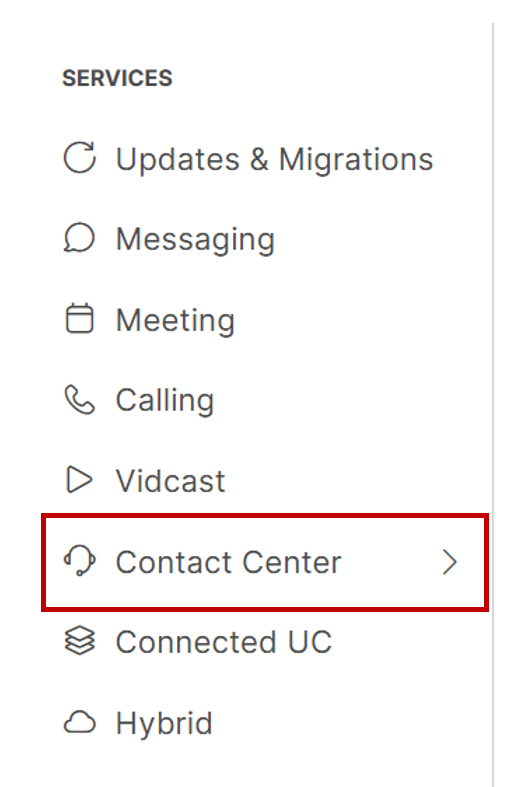{ width="200" }

- In the Contact Center navigation pane on the left side, scroll down to the Tenant Settings section and click on General.

      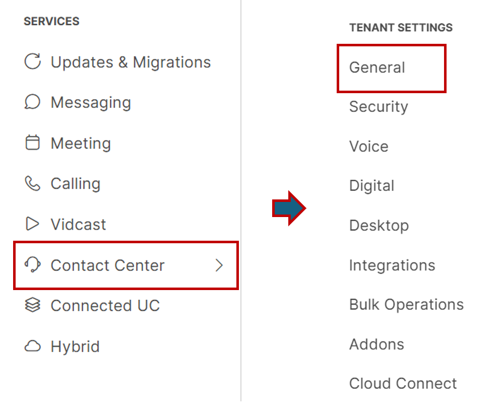{ width="500" }

- Under the General settings, locate the Telephony type. Confirm that it states: **Webex Calling**.

      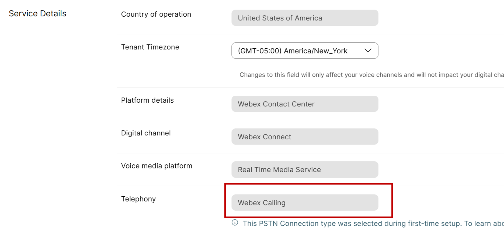{ width="700" }

- In the Contact Center navigation pane, under the Customer Experience section, select Channels and search for the entry point named: **EP_1**.

      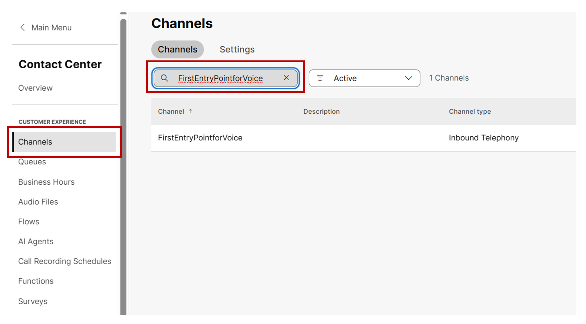{ width="700" }

- Within the details for **EP_1**, locate the Phone Number section and note the Webex Calling location and the Support Number.

      - Webex Calling location: [**site1**]
      - Support Number: [+19842990142]

      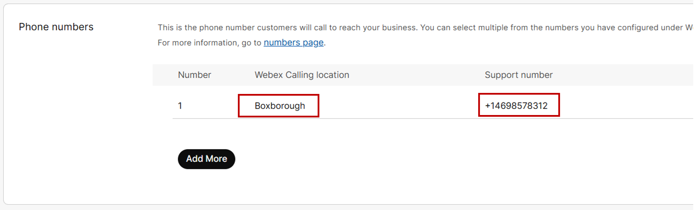{ width="700" }

- Go back to the main menu of Control Hub. 

- Under the Management section, select Locations. In the Locations search bar, enter the Webex Calling location name you discovered in the previous step. 

      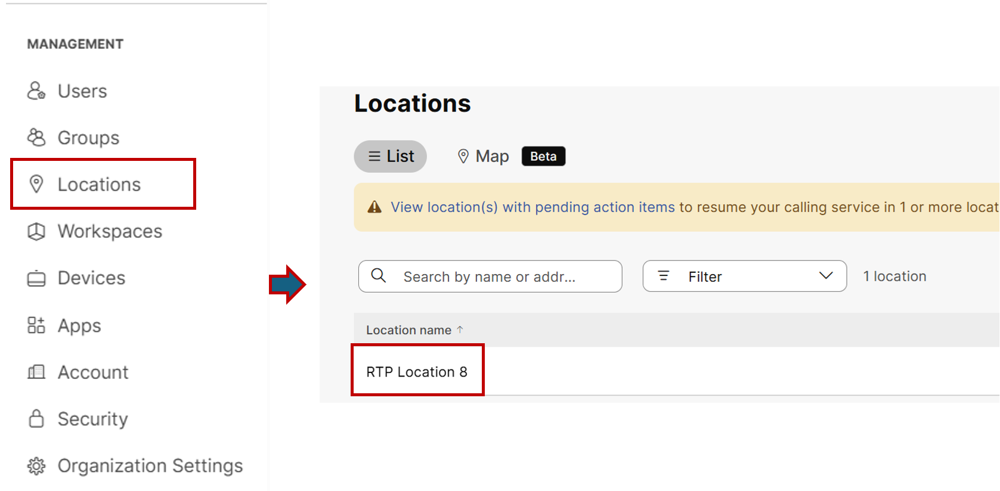{ width="700" }

- Select the discovered location and click on the Calling Connection details. In Main number section select the "support Number" Identified in the previous step.  In our case, the calling PSTN connection is: Cisco Calling Plan.

      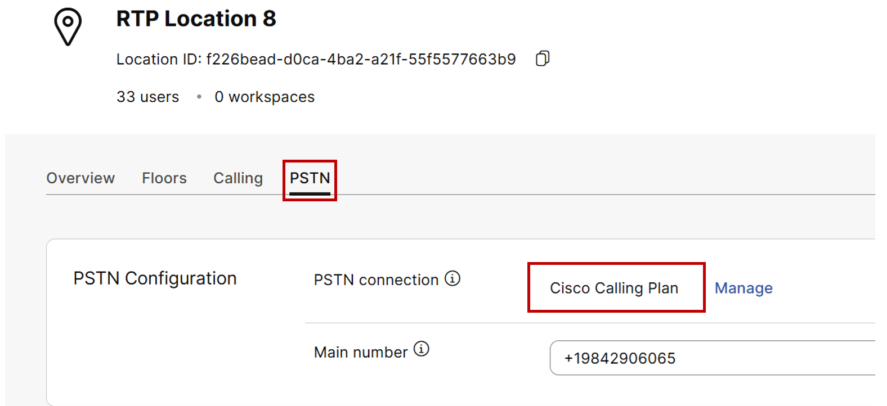{ width="700" }

- Based on the observed calling connection (e.g., Cisco Calling Plan) and the information presented in the call flow slides, this configuration matches Flow Type 1.

## Section 2 : Configre and Debug an Inbound Flow

- The steps below outline the process for configuring an incoming call, ensuring all necessary settings are in place for the agent to receive the call.

- First, to enable call handling options for the agent, navigate to "Contact Center" in the Control Hub.

      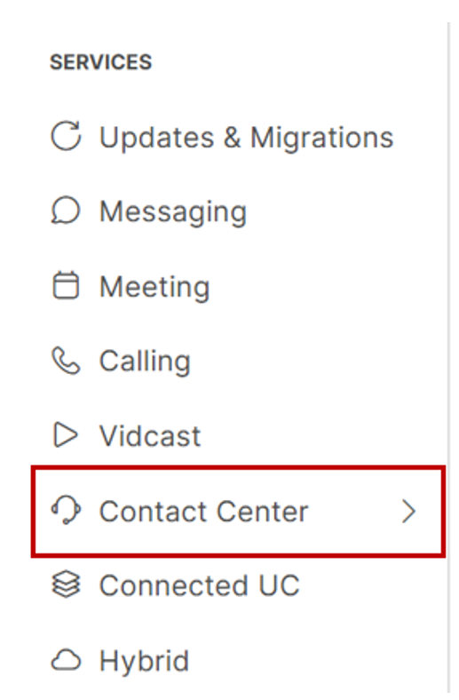{ width="200" }

- Go to "Tenant Settings" and select "Desktop."

      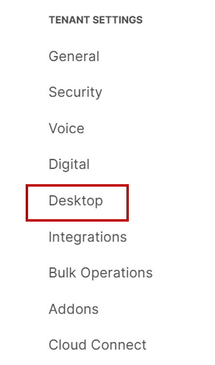{ width="200" }

- Confirm that 
      - "End Call" and "**End Consult**"is enabled.
      - "Auto Wrap-up interval" is set to **600 seconds**.
      - "Telephony RONA timeout" is set to **12 seconds**.

      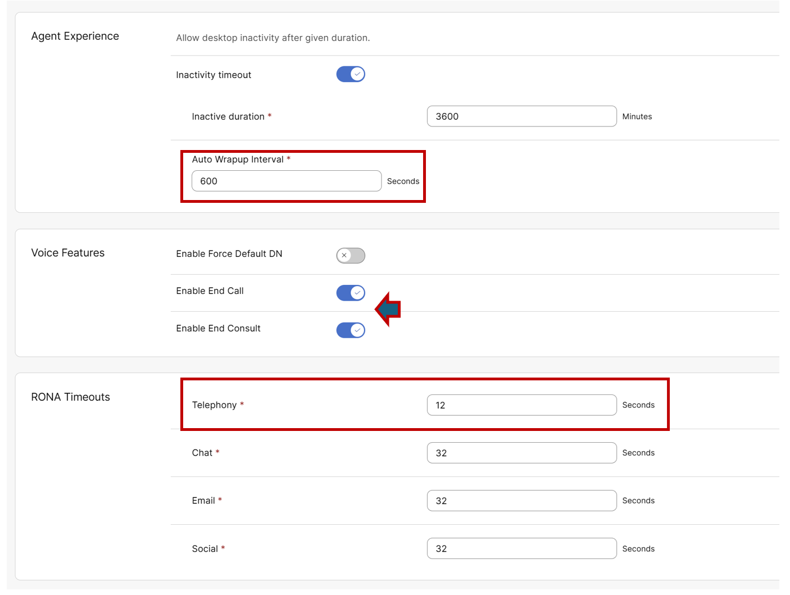{ width="700" }

- Navigate to "Desktop Experience" and select "Desktop Profiles."

      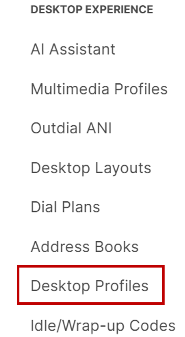{ width="200" }

- Choose the ??????? and verify that the "Voice Channel" options are configured as shown in the provided screenshot.

      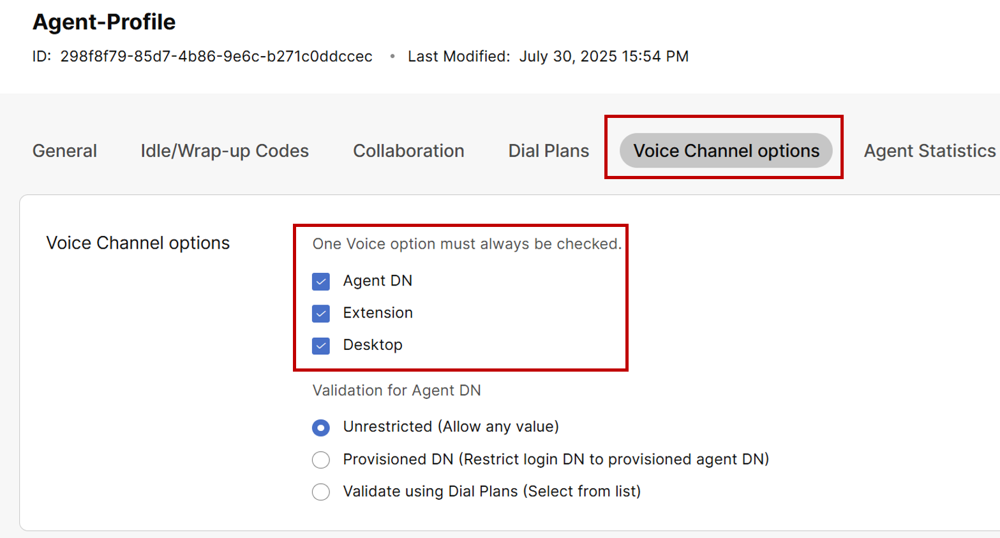{ width="700" }

!!! Note 
       Depending on the customer's business needs, the desired option can be selected. For example, if a customer wants all of their agents to use WebRTC and no other endpoints, only the 'Desktop' option can be checked. Agents will then only see the desktop option when logging into the desktop. 

- To confirm that the agent is mapped to this profile, go to the "Contact Center users" section in "User management."

      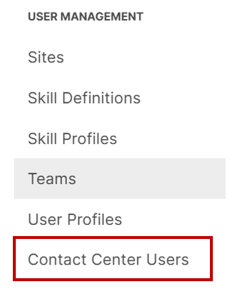{ width="200" }

- Search for the agent <?????????> and, in their agent settings, ensure that the "desktop profile" is mapped to <?????????>.

      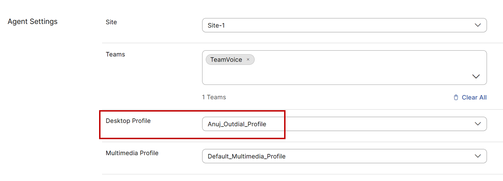{ width="700" }

- Now, let's start building the entry point for the external call. To do this, navigate to "Customer Experience" and select "Channels."

      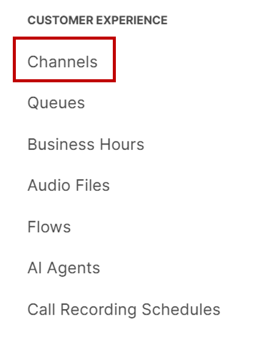{ width="200" }

- Click "Create a channel."

- In the "Channel Creation Wizard," provide the following details:
      - Name: **Provide a descriptive name for your channel**
      - Channel Type: **Inbound Telephony**

      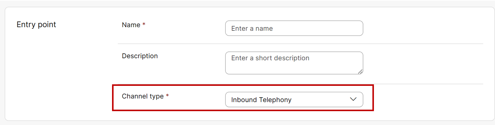{ width="700" }

   
      - Service Level Threshold: **30 seconds**
      - Timezone: **America/New York**
      - Routing flow: **Select ???????**
      - Music on hold: **defaultmusic_on_hold**
      - Version label: **Latest**

      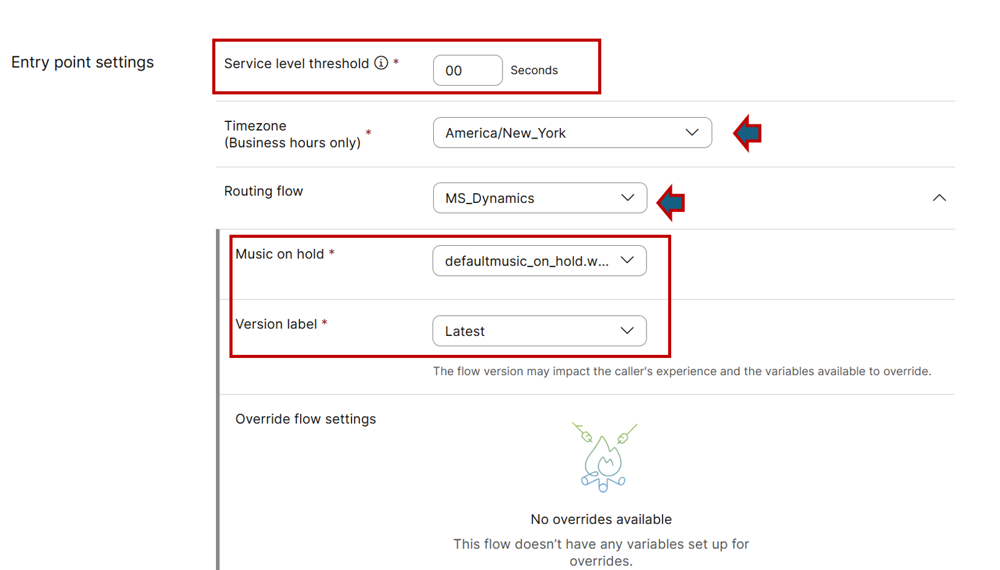{ width="700" }

- In the "Phone numbers" section, select the following:
      - Number Webex Calling location: **???????**
      - Support number: **???????**
      - PSTN Region: **???????**

      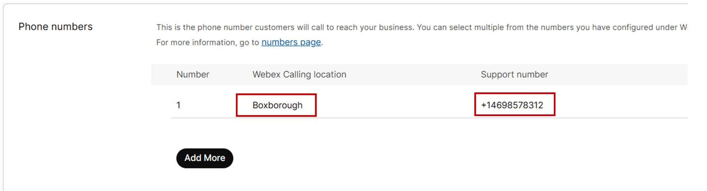{ width="700" }

- After adding these settings, click "Create" to finalize the channel.

- The way an incoming call is presented to an agent in agent-based routing is via the entry point to the routing flow and the flow mapped to the queue which has the team the agent belongs to.

- With this logic, let's check the queue and make the necessary configuration.

- In the Contact Center navigation pane, under Customer Experience, select Queues. Search for the queue **??????**. 

      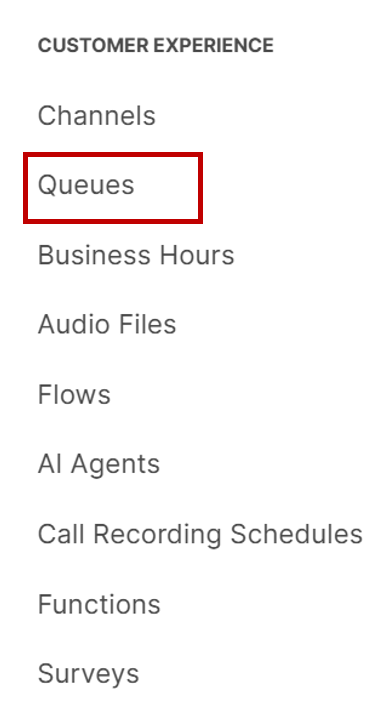{ width="200" }

- In Contact Routing Settings, confirm these settings:
      - Agent Assignment: Teams
      - Routing Pattern: Longest available

      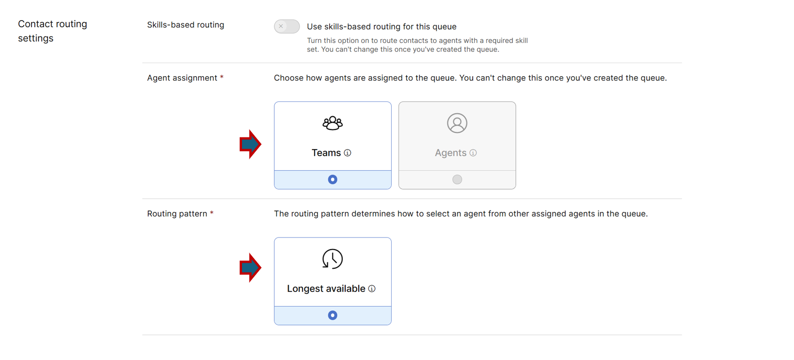{ width="800" }

- For, Call Distribution: Create the group and in group 1, click on the action and ensure the team **team** is added.

      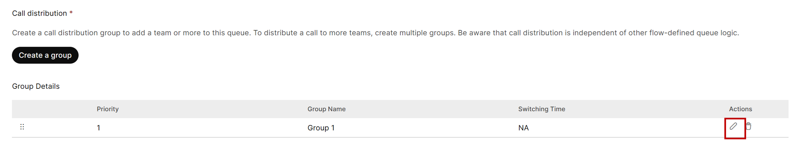{ width="600" }

      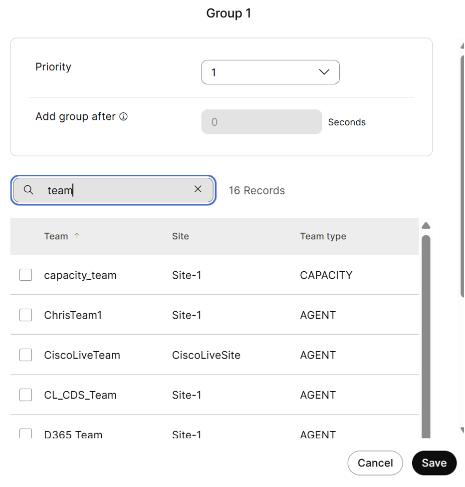{ width="500" }

- In Advanced Settings, ensure that these values are accurate:
      - Service Level Threshold: **30 seconds**
      - Maximum Time in Queue: **30 seconds**
      - Default Music in Queue: **defaultmusic_on_hold.wav**

      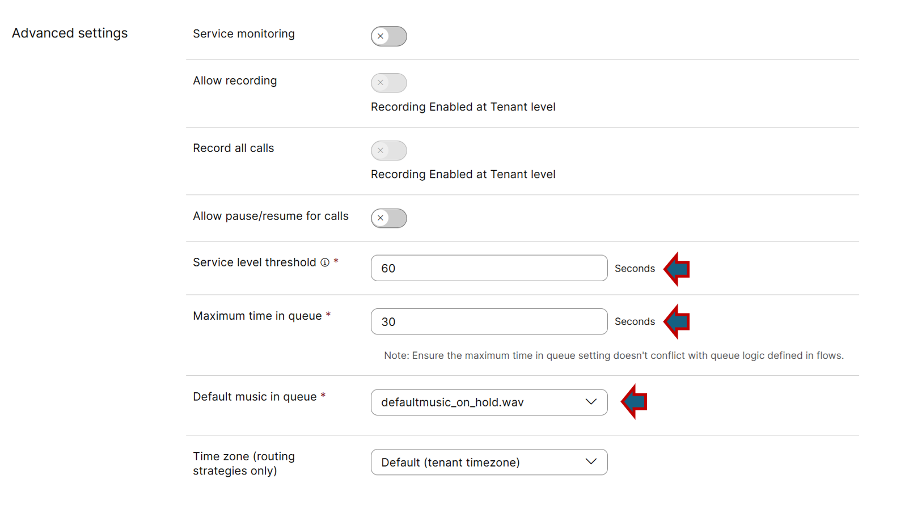{ width="800" }

- Click Save to finalize the queue.

- It's time to now test the call. To do this, log in to the Agent Desktop using the provided credentials.
      - URL: https://desktop.wxcc-us1.cisco.com/
      - Username: **Contact the lab proctor if information is unavailable.**
      - Password: **Contact the lab proctor if information is unavailable.**  

- Please select **Desktop** as the telephony option, set the Team as **?????** , and log in.  

- Place a call from your cell phone to the Dialed Number **?????** and option 0 to reach the logged-in agent.  

- However, you will notice the call is never presented to the agent, and the caller hears music on hold. 

- Let's troubleshoot to see why the call is not reaching the agent. The best way will be to look at the flow to see what is happening with the call.  

- In the customer experience section, select "Flows" and search for the flow you have mapped to the entry point, "**??**"

      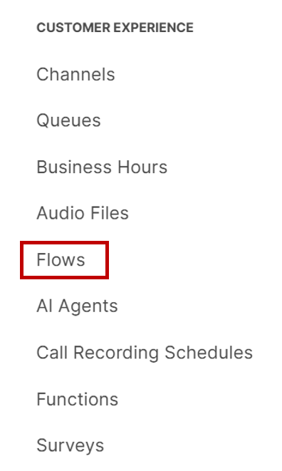{ width="200" }

- Click on the "Debug" option and review the last call.

      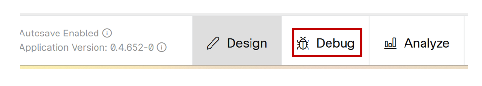{ width="700" }

- You will notice that the call passed through the "**Menu**" node, was parked into the queue where the entered option was "**0**," and the "**Play message**" node played the assigned WAV file.

<<<<????? Scren shot Needed >>>>

- In the "QueueContact" node, you will see an "Activity Output QueueID."

<<<<????? Scren shot Needed >>>>

- This ID belongs to a queue that you have not configured with a team and agent, so the call is not reaching the agent.  

- To correct this, come back into the Design section of the flow and click on the "Edit" option in the flow.

      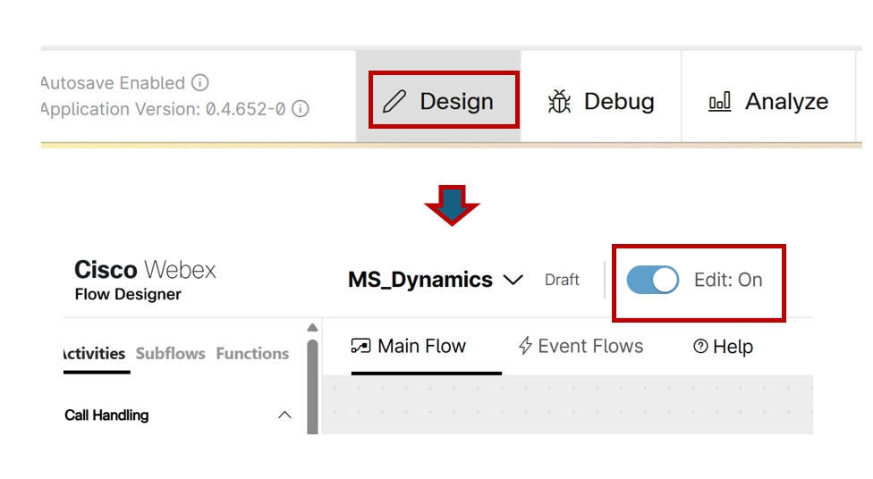{ width="700" }

- Select the "Queue contact" node, and from the drop-down menu, select the queue that has your team and the agent.

      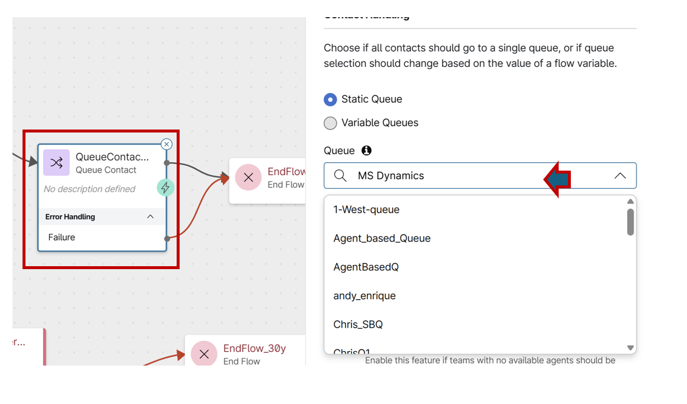{ width="700" }

- Toggle "Validation" to "On" to ensure there are no validation errors, and then publish the flow.

      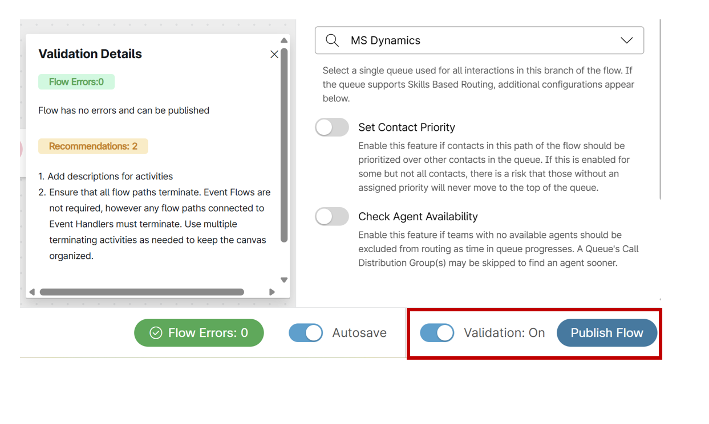{ width="700" }

!!! Note 
      When publishing, it is important to ensure the label you have set is the same one that was set when the entry point was being mapped to the routing flow.

- Place another call from your cell phone to the dialed number **????** and select option 0 to succesfully reach the logged-in agent.  

- In the Flow Canvas you can now also check how the calls have travered through valrious nodes by cliking on the Analyze capability and selecting the current day.

      { width="700" }

## Section 3: Analyze Agent Performance with Call Reports

- The goal of this lab section is to review reports to determine what happened with few calls. To create a dataset of calls, lets simulate some common agent-side issues.

- First, ensure that the agent is ready and make a call from your cell phone. When the call is presented to the agent, do not accept it. Let the call ring for 12 seconds until it goes to a "no answer" state.

- Next, make another call. This time, when the call is presented to the agent, reject the call.

- Now that you have a variety of calls in the system, you can explore the reports to see how to track "Contact Offer" and "Assignment Failures" to the agent.

- In Control Hub under "Contact Center" select "Overview." In the "Quick Links" section on the right, select "Analyzer."

- Click on "Visualization" and select the folder with your user details, <USer*_Webexone>.

- There are two reports in the folder which are copy of the stock report: 
      - "Agent Trace Report" and 
      - "Queue Activity By Queue Report.
      
- Each report includes three columns:
      - RONA Count: This captures all calls that failed because the configured RONA timer expired in WxCC (reasonCode: RONA_TIMER_EXPIRED) or  Because of a configured ring timeout on the device (reasonCode: NO_ANSWER_USER). 
      - Call Reject Count: This tracks all calls that failed because the agent explicitly declined the call (reasonCode: USER_DECLINED). 
      - Other Error Counts: This reflects call offer and assignment failures to the agent caused by any other error.

- To review the "Agent Trace" report, first click on the "Edit" option and ensure that the start time is set for "Today."

- In the profile variables, you can also confirm that the three variables i.e. RONA Count, Call Reject Count, and Other Error Counts—are present.

- Save the visualizationand Click the "Preview" option.

- You should now see counts for "RONA" and "Call Reject." Click on the value and the magnification symbol for a further drill-down of the number.

- A new window will pop up with all the details of this call. As needed, you can add fields and measures from the available options to get all the desired information related to the call and the agent.

- To test this, you can click on "Agent ID" and it will be appended to the end of the report as a new column.

-  The same process can be used to explore the "Queue Activity By Queue" report.

Congratulations ! on completing this section of the lab! 

You've successfully navigated the complexities of call flow configuration, debugged common issues, and learned how to analyze agent performance by simulating and tracking different call outcomes in reports.
