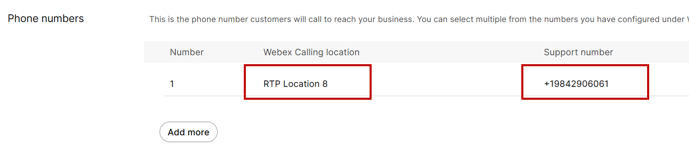
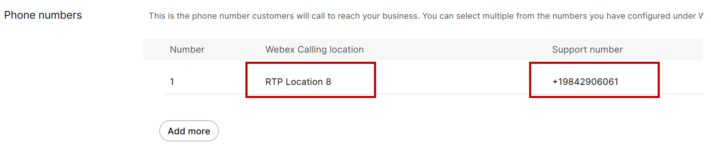
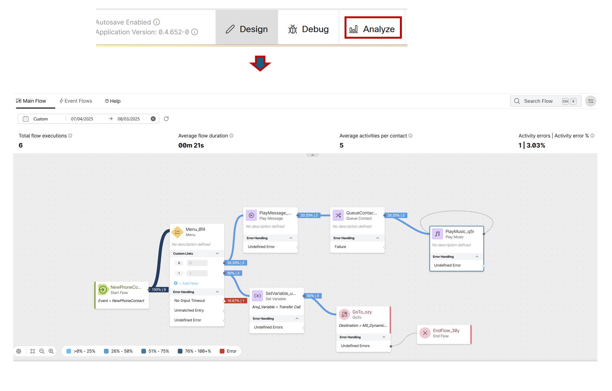

# Lab 1 - Configure and Debug Tenant Call Flows

Please use the following credentials to connect to Control Hub and configure Webex Contact Center:

| <!-- -->         | <!-- -->         |
| ---------------- | ---------------- |
| `Control Hub URL`            | <a href="https://admin.webex.com" target="_blank">https://admin.webex.com</a> |
| `Username`       | labuser**ID**@wx1.wbx.ai  _(where **ID** is your assigned pod number; this ID will be provided by your proctor)_ |
| `Password`       | webexONE1! |

## Objective 

The objective of this self-paced lab is to provide participants with hands-on experience in configuring and debugging tenant call flows, as well as analyzing agent performance through call reports. This excercise has been divided into three sections

- **Section 1**: Discover Tenant Call Flow Configuration:
This section aims to familiarize participants with the existing call flow configurations within a tenant environment.

- **Section 2**: Configure and Debug an Inbound Flow:
In this part, participants will set up an inbound flow with a whisper announcement and a "Team" and "Longest Available" distribution strategy. They will use the flow debugger to identify and resolve common misconfigurations encountered during the setup process.

- **Section 3**: Analyze Agent Performance with Call Reports:
After creating the inbound flow and presenting calls to a test agent, participants will intentionally trigger specific events. They will reject one call and allow a second to result in a Re-Route on No Answer (RONA) event. This will enable them to explore and analyze call reports to understand agent behavior and pinpoint the root cause of the rejected and RONA calls.

## Section 1 : Discover Tenant Call Flow Configuration

- Open your web browser and navigate to [https://admin.webex.com](https://admin.webex.com)

- Log in using the provided credentials.

- In Control Hub, locate Services and click on Contact Center. 

      { width="200" }

- In the Contact Center navigation pane on the left side, scroll down to the Tenant Settings section and click on General.

      { width="400" }

- Under the General settings, locate the Telephony type. Confirm that it states: **Webex Calling**.

      { width="700" }

- In the Contact Center navigation pane, under the Customer Experience section, select Channels and search for the entry point named: **Entry Point-1**.

      { width="700" }

- Within the details for **Entry Point-1**, locate the Phone Number section and note the Webex Calling location and the Support Number.

      - Webex Calling location: [**RTP Location 8**]
      - Support Number: [+19842906065]

      { width="700" }

- Go back to the main menu of Control Hub. 

- Under the Management section, select Locations. 

- In the Locations search bar, enter the Webex Calling location name you discovered in the previous step. 

      { width="700" }

- Select the discovered location. 

- In the **PSTN tab**, under the **PSTN Configuration** section, the identified connection is **Cisco Calling Plan**.

      { width="500" }

- Click on the **Manage** section and it provides all the details of the **connection type**

      { width="300" }

- Based on the observed calling connection (e.g., Cisco Calling Plan) and the information presented in the call flow slides, this configuration matches Flow Type 1.

## Section 2 : Configure and Debug an Inbound Flow

- The steps below covers the process for handling an incoming call, ensuring all necessary settings are in place for the agent to receive the call.

- First, to enable call handling options for the agent, navigate to "Contact Center" in the Control Hub.

      { width="200" }

- Go to "Tenant Settings" and select "Desktop"

      { width="200" }

- Confirm that 
      - "**End Call**" and "**End Consult**"is enabled.
      - "Auto Wrap-up interval" is set to **600 seconds**.
      - "Telephony RONA timeout" is set to **12 seconds**.

      { width="700" }

- Navigate to "Desktop Experience" and select "Desktop Profiles."

      { width="200" }

- Choose the **WebexOne_AgentProfile** and verify that the "Voice Channel" options are configured as shown in the following screenshot.

      { width="700" }

!!! Note 
       Depending on the customer's business needs, the desired option can be selected. For example, if a customer wants all of their agents to use WebRTC and no other endpoints, only the 'Desktop' option can be checked. Agents will then only see the desktop option when logging into the desktop. 

- To confirm that the agent is mapped to this profile, go to the "Contact Center users" section in "User management."

      { width="200" }

- Search for your agent **labuserID@wx1.wbx.ai** and, in their agent settings, ensure that the "desktop profile" is mapped to **WebexOne_AgentProfile**.

      { width="700" }

- Now, let's start building the entry point for the external call. To do this, navigate to "Customer Experience" and select "Channels."

      { width="200" }

- Click "Create a channel."  

- In the "Channel Creation Wizard," provide the following details:
      - Name: **Provide a descriptive name for your channel**
      - Channel Type: **Inbound Telephony**

      { width="700" }

   
      - Service Level Threshold: **30 seconds**
      - Timezone: **America/New York**
      - Routing flow: **Select Webexone_Flow_[num]** (Num is the assigned assignee's number)
      - Music on hold: **defaultmusic_on_hold**
      - Version label: **Latest**

      { width="700" }

- In the "Phone numbers" section, select the following:
      - Number Webex Calling location: **RTP Location 8**
      - Support number: **Choose the available Number**
      - PSTN Region: **Default**

      { width="700" }

- After adding these settings, click "Create" to finalize the channel.  

- The way an incoming call is presented to an agent in agent-based routing is via the entry point to the routing flow and the flow mapped to the queue which has the team the agent belongs to.  

- With this logic, let's check the queue and make the necessary configuration.  

- In the Contact Center navigation pane, under Customer Experience, select Queues. 

      { width="200" }

- Click the **Create a Queue** button

      { width="200" }

- Configure the new queue by providing the name **WebexOne_Queue_[num]** and ensuring these settings match:
      -  Contact Direction : Inbound Queue 
      -  Channel Type : Telephony 

      { width="700" }

- In Contact Routing Settings, confirm these settings:
      - Agent Assignment: Teams
      - Routing Pattern: Longest available

      { width="800" }

- For, Call Distribution: In group 1, click on the action and ensure the team **WebexOne_Team_[num]** is added.

      { width="600" }

      { width="400" }

- In Advanced Settings, ensure that these values are accurate:
      - Service Level Threshold: **30 seconds**
      - Maximum Time in Queue: **30 seconds**
      - Default Music in Queue: **defaultmusic_on_hold.wav**

      { width="800" }

- Click Save to finalize the queue.  

- It's time to now test the call. To do this, log in to the Agent Desktop using the provided credentials. 
      - URL: https://desktop.wxcc-us1.cisco.com/
      - Username: **Contact the lab proctor if information is unavailable.**
      - Password: **Contact the lab proctor if information is unavailable.**  

- Please select **Desktop** as the telephony option, set the Team as **WebexOne_Team_[num]** , and log in.  

- Ensure that the agent is in **Avaialable** Status on the desktop. 

- Place a call from your cell phone to the Dialed Number assigned to your entry point and select option 0 to reach the logged-in agent.  

- However, you will notice the call is never presented to the agent, and the caller hears music on hold. 

- Let's troubleshoot to see why the call is not reaching the agent. The best way will be to look at the flow to see what is happening with the call.  

- In the browser tab/window containing Contact Center navigation pane select "Flows" under customer experience section and search for the flow you have mapped to the entry point, **WebexOne_Flow_[num]**

      { width="200" }

- Click on the "Debug" option and review the last call.

      { width="700" }

- You will notice that the call passed through the "Menu" node, where option "0" was pressed.

      { width="900" }

- Then, the call landed in the queue node where the selected queue had the ID "4d0282c7-6478-444b-b41a-8e331614acae".

      { width="900" }

- Now, the call moves to the "Play Music" node, where "defaultmusic_on_hold.wav" is played instead of being presented to the logged-in agent.

      { width="900" }

- To figure out what queue it is in the Control Hub, go to the "Queues" section and in the URL, append the queue ID "/4d0282c7-6478-444b-b41a-8e331614acae" noted before and load the page.

      { width="700" }

- The queue page that loads is "**WebexOne_Queue_Anuj**" which is not the correct queue for the agent who is logged in.

      { width="700" }

- To correct this, come back into the Design section of the flow and click on the "Edit" option in the flow.

      { width="700" }

- Select the "Queue contact" node, and from the drop-down menu, select the queue that has your team and the agent i.e **WebexOne_Queue_[num]**

      { width="700" }

- Toggle "Validation" to "On" to ensure there are no validation errors, and then publish the flow.

      { width="700" }

!!! Note 
      When publishing, it is important to ensure the label you have set is the same one that was set when the entry point was being mapped to the routing flow.

- Place another call from your cell phone to the dialed number you have assigned and select option 0 to succesfully reach the logged-in agent.  

- In the Flow Canvas you can now also check how the calls have travered through valrious nodes by cliking on the Analyze capability and selecting the current day.

      { width="900" }

## Section 3: Analyze Agent Performance with Call Reports

- The goal of this lab section is to review reports to determine what happened with few calls. 

- To create a dataset of calls, lets simulate some common agent-side issues.

- First, ensure that the agent is ready and make a call from your cell phone. 

- When the call is presented to the agent, do not accept it. Let the call ring for 12 seconds until it goes to a "no answer" state. 

- Hangup to disconnect the call.

      { width="500" }

- Next, make another call. 

- This time, when the call is presented to the agent, reject the call. Disconnect call from your cell phone.

      { width="600" }

- Now that you have a variety of calls in the system, you can explore the reports to see how to track "**Contact Offer**" and "**Assignment Failures**" to the agent.

- In Control Hub under "Contact Center" select "Overview." In the "Quick Links" section on the right, select "Analyzer."

      { width="500" }

- Click on "Visualization" and double-click the folder **WebexOne_Report_User[num]** containing your user details.

      { width="500" }

- There are two reports in the folder which are copy of the stock report: 
      - "**Agent Trace Report**" and 
      - "**Queue Activity By Queue Report**".

      { width="800" }
      
- Each report includes three columns:
      - **RONA Count**: This captures all calls that failed because the configured RONA timer expired in WxCC (reasonCode: RONA_TIMER_EXPIRED) or  Because of a configured ring timeout on the device (reasonCode: NO_ANSWER_USER). 
      - **Call Reject Count**: This tracks all calls that failed because the agent explicitly declined the call (reasonCode: USER_DECLINED). 
      - **Offer Error Counts**: This reflects call offer and assignment failures to the agent caused by any other error.

- To review the "Agent Trace" report, first click on the "Edit" option 

      { width="700" }

- Ensure that the start time of the report is set for "Today."

      { width="300" }

- In the profile variables, you can also confirm that the three variables i.e. **RONA Count**,**Call Reject Count** , and **Offer Error Counts—are** present.

      { width="850" }

- Save the visualizationand Click the "Preview" option.

- You should now see counts for "RONA" and "Call Reject." Click on the value and the magnification symbol for a further drill-down of the number.

      { width="1000" }

- To easily review the calls in the report, use the Custom Select option in Agent Name to search for the designated user and their calls

      { width="600" }

- A new window will pop up with all the details of this call. As needed, you can add fields and measures from the available options to get all the desired information related to the call and the agent.

      { width="1000" }

- To test this, you can click on "Agent ID" and it will be appended to the end of the report as a new column.

-  The same process can be used to explore the "**Queue Activity By Queue**" report.

**Congratulations!!** on completing this section of the lab! 

You've successfully navigated the complexities of an inbound call flow configuration, debugged common issues, and learned how to analyze agent performance by simulating and tracking different call outcomes in reports.
