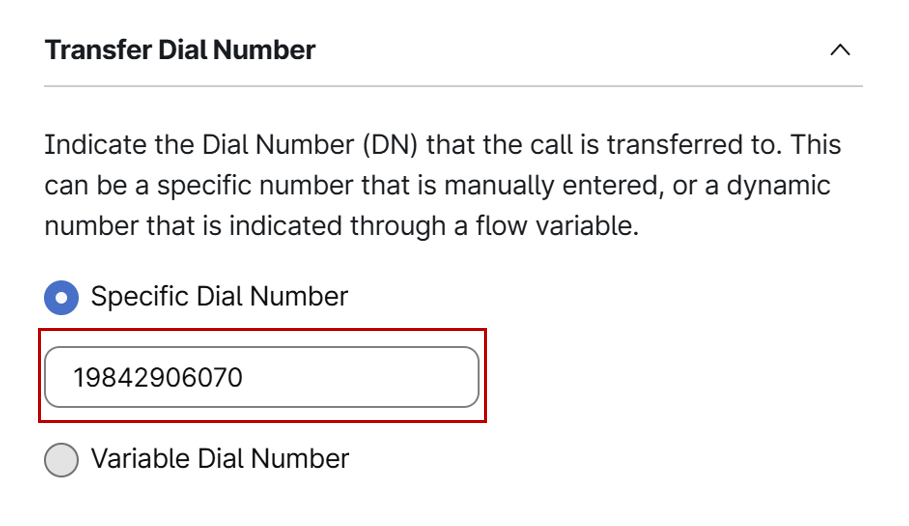

# Lab 2 - Seamless Call Transfer & Preserving flow Variables

Please use the following credentials to connect to Control Hub and configure Webex Contact Center:

| <!-- -->         | <!-- -->         |
| ---------------- | ---------------- |
| `Control Hub URL`            | <a href="https://admin.webex.com" target="_blank">https://admin.webex.com</a> |
| `Username`       | wxccemealabs+admin**ID**@gmail.com  _(where **ID** is your assigned pod number; this ID will be provided by your proctor)_ |
| `Password`       | ciscoliveAMER25! |

## Objective 

The objective of this exercise is to correct a call flow that currently loses global variables during a transfer.

The current flow is as follows: 

- A customer calls and presses option 1, which transfers the call to another department. This transfer causes the call to leave the system and re-enter through a new entry point, creating a new call leg. Within this new flow, the customer presses the user ID option to reach the correct team and agent.

- This process presents two main issues for the business:
      - The call is unnecessarily leaving and re-entering the system.
      - All original global variables are lost during this transfer, which prevents the agent from seeing crucial information.

- The task is to correct this flow so that the call is transferred seamlessly to the correct destination while preserving all original global variables for the agent.

## Section 1 : Experience the Issue

- Ensure that the agent is logged into the desktop and has an "Available" status.

- Call the provided number "**+1.....**" from your cell phone and press Option 1. 

- You will hear a **ringback** and a menu prompting you to enter your user ID.

- The **ringback** you hear is the **first issue**, as it indicates a new call is being made and hitting a new entry point.

- Once you enter your user ID, the call will be presented to the agent.

- Accept the call. 

- On the desktop, you should see two flow variables, "**Wbex_one_Tansfer**" and "**Webex_one**" However, you will notice that they are not appearing.

      { width="800" }

- **This is the second problem**: The original flow variables collected in the first flow are being dropped during the transfer.

## Section 2 : Inspect the Flow

- To understand why this is happening, let's inspect the first flow.

- In the Customer Experience section of Control Hub, select "Flows" and search for the flow you have mapped to your entry point, "**WebexOne_Flow_User[num]**."

      { width="200" }

- In the menu node for Option 1, you will notice that it maps to a "**Blind Transfer**" node.

      { width="700" }

- Select the Blind Transfer node, and you will see it is transferring the call to a number "**19842990193**" that is mapped to a different flow called "**Webexone_transfer**"

      { width="500" }

- This is the core of the problem. We are instructing the flow to transfer the call to an external number, which creates a new call leg. As a result, the variables as well defined in this flow are not being passed to the "**Webexone_transfer**" flow.

- To check these variables, click on any empty space on the flow canvas and review the right side of the flow.

      { width="500" }

## Section 3 : Correct the Flow 

- To rectify this, we need a node that handles internal transfers more effectively. 

The Flow Designer provides a "GoTo Node" specifically for this use case.

Note!!!
  A GoTo Node is used to seamlessly transfer a call to another flow within the same system, preserving variables. 
  A Blind Transfer node is used to transfer a call to an external number.

- To replace the Blind Transfer node, first enable the edit mode of the flow designer.

      { width="500" }

- Delete the Blind Transfer node by selecting it and pressing the delete key.

      { width="700" }

- From the Flow Control section, drag a "GoTo Node" onto the canvas.

      { width="200" }

- In the GoTo Node's properties, select "Entry point" as the destination type and map it to "**WebexOne_Transfer_EP**"

      { width="700" }

- Connect the Menu node's Option 1 output to the GoTo Node and the "undefined" error output to the "End of the flow" node, as shown in the screenshot above 

- Toggle "Validation" to "On" to ensure there are no validation errors, and then publish the flow.

      { width="500" }

## Section 4 : Verify the Solution

- Ensure that the agent is logged into the desktop and has an "Available" status.

- Call your provided number from your cell phone again and press Option 1. 

- You should hear no ringback, but instead, be directly presented with the menu option to enter your user ID.

- This resolves the first problem of creating a new call leg for the transfer.

- Once you provide the user ID, the agent should receive the call.

- After the call is accepted, you should now see the two variables defined in the first flow on the agent desktop.

      { width="900" }

- This confirms that the second problem of variables being lost has also been resolved.

**Congratulations !!** on successfully completing this exercise! 

You've learned how to perform seamless internal transfers within entry points and now understand the crucial difference between a Blind Transfer and a GoTo Nod

