# Lab 3 -  Set Up Outdial Calls in WxCC

Please use the following credentials to connect to Control Hub and configure Webex Contact Center:

| <!-- -->         | <!-- -->         |
| ---------------- | ---------------- |
| `Control Hub URL`            | <a href="https://admin.webex.com" target="_blank">https://admin.webex.com</a> |
| `Username`       | wxccemealabs+admin**ID**@gmail.com  _(where **ID** is your assigned pod number; this ID will be provided by your proctor)_ |
| `Password`       | ciscoliveAMER25! |

## Objective 

In this lab exercise, the audience will gain hands-on experience configuring WxCC solutions to enable outdial capabilities from scratch. Furthermore, the exercise will also equip participants with essential debugging skills to identify and rectify frequent implementation errors ensuring a robust and functional deployment.

## Section 1 : Setup Outdial 

- Log in to https://admin.webex.com with the provided credentials.

- In Control Hub, navigate to Services and click on Contact Center.

      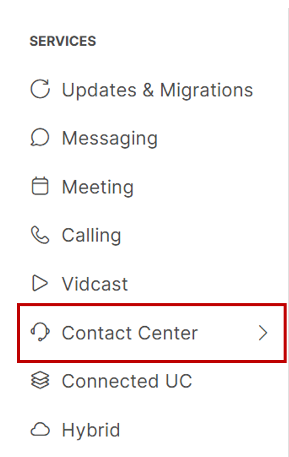{ width="200" }

- In the Contact Center navigation pane, under Customer Experience, select Queues.

      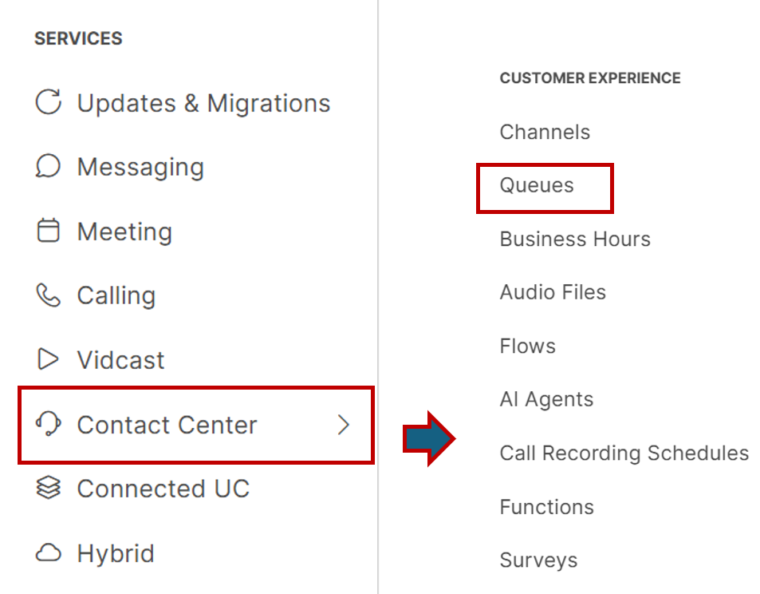{ width="400" }

- Create a new queue by clicking on the "Create a Queue" option.

- The Queue Creation Wizard will appear. Provide the following details:

      - **General**
           - **Name**: [Provide a descriptive name for your queue]
           - **Contact Direction**: Outdial Queue
           - **Channel Type**: Telephony

      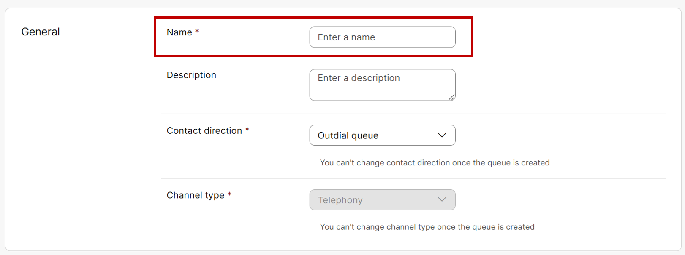{ width="800" }

      - **Contact Routing Settings**
           - **AgentAssignment**: Teams
           - **Routing Pattern**: Longest available
           - **Call Distribution**: Create a group and add the team **WebeOne_Team_[num]**

      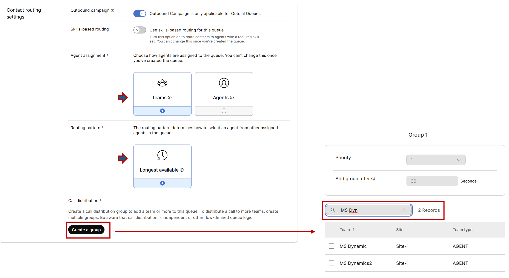{ width="700" }

      - **Advanced Settings**
           - **Service Level Threshold**: 30 seconds
           - **Maximum Time in Queue**: 30 seconds
           - **Default Music in Queue**: defaultmusic_on_hold.wav

      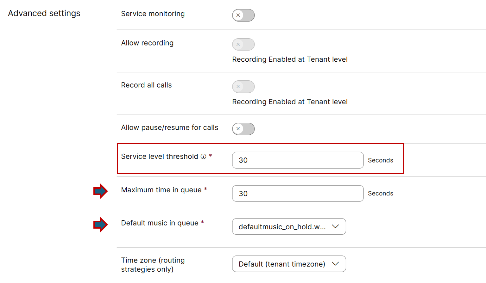{ width="700" }

- Once these settings are added, click Create to finalize the queue.

- Lets create a Entry point to map the queue to this entry point. 

- Navigate back to Customer Experience in Contact Center and click on Channels.

      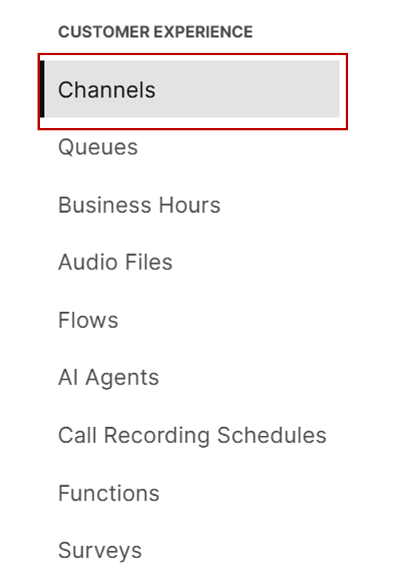{ width="200" }

- Create a new channel by clicking on the "Create a channel" option.

      { width="180" }

- The Channel Creation Wizard will appear. Provide the following details:

      - **Name**: [Provide a descriptive name for your channel]
      - **Channel Type**: Outbound Telephony
      - **Service Level Threshold**: 30 seconds
      - **Timezone**: America/New York

      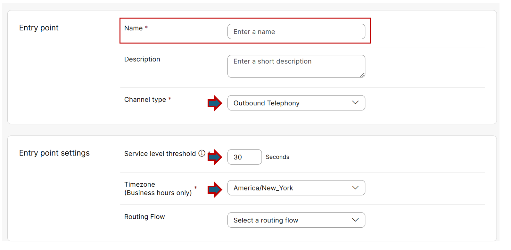{ width="750" }

- After these settings are added, click Create to finalize the channel.

- Since outdial is an agent activity, the Agent Desktop should have the capability to call any number outside the WxCC ecosystem. 

- To enable this capability, create an agent profile and map it to the agent.

- Navigate to Desktop Experience in Contact Center and click on Desktop Profiles.

      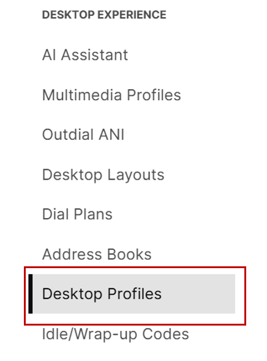{ width="200" }

- In Desktop Profiles, create a new profile by clicking on "Create Desktop Profile".

      { width="200" }

- In the General section, provide the desired name for your profile.

      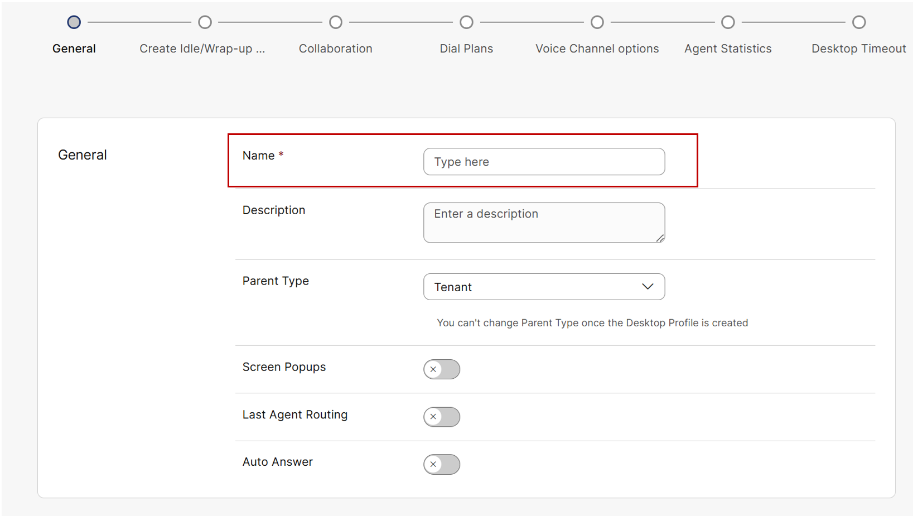{ width="700" }

- Move to "Dial Plans" by clicking Next.

- Enable "**Outdial**".
      - Select the newly create entrypoint as an "**Outdial Entry Point**".
      - Select the preconfigured address book "**WebexOne_outdial_AddressBook**" as an "**Address Book**".

      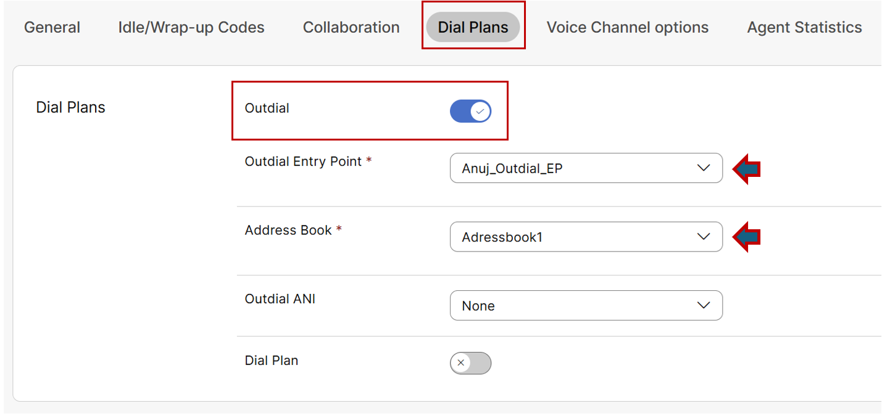{ width="700" }

- Move to "Voice Channel Options" by clicking Next and ensure that "Desktop" is enabled under "Voice Channels options".

      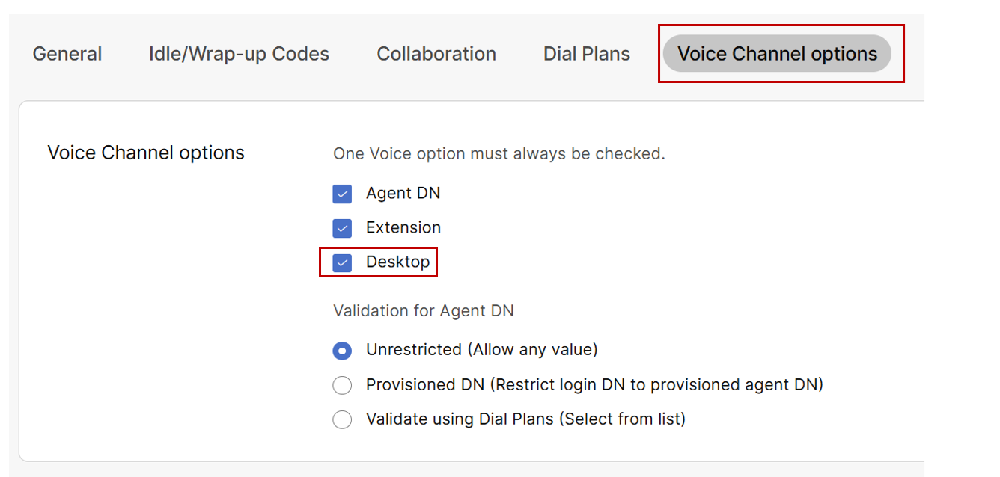{ width="700" }

- Proceed to the end of desktop profile creation by clicking Next and finally Create.

- Now, Navigate to the "Contact Center Users" section.

- Assign your newly created desktop profile under "Desktop Profile" and Save changes.

      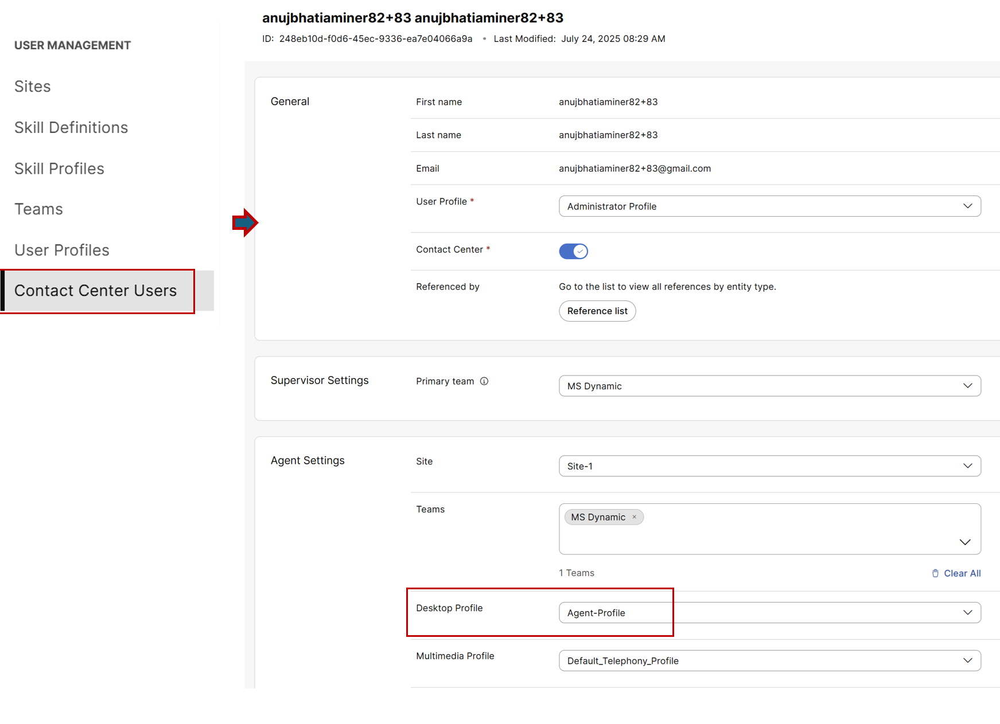{ width="800" }

## Section 2 : Test Outdial 

- Now, log in to the Agent Desktop using the provided credentials.
      - **URL**: https://desktop.wxcc-us1.cisco.com/
      - **Username**: Contact the lab proctor if information is unavailable.
      - **Password**: Contact the lab proctor if information is unavailable.

- Please select desktop as telephony option and set the Team as **WebexOne_Team_[num]** and login.

<<<<<<<<<<sCREEN shOT>>>>>>>>>>

- Present task is to dial your cell phone number. 

- First, click the Outdial Call option on the top right corner of the desktop. 

      { width="300" }

- You'll notice that the dial pad is missing; the only available option is to search by name, email, or number within the tenant. 

      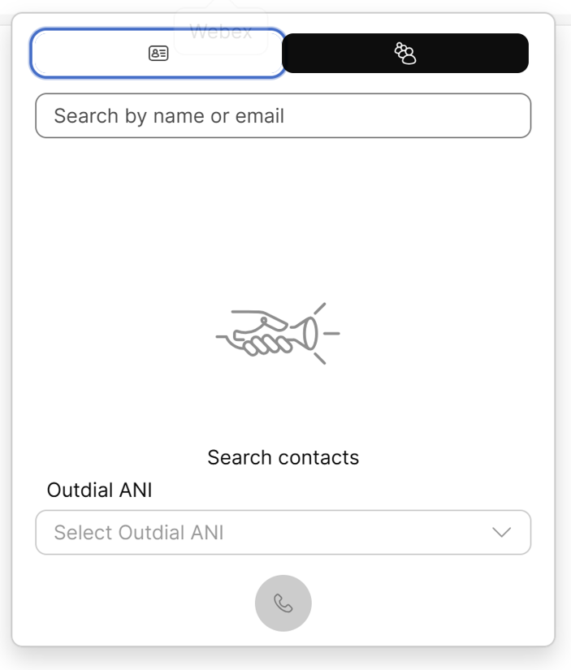{ width="500" }

- This prevents us from dialing an individual cell phone number directly. 

- To fix this, we need to find where the dial pad setting is controlled. 

- Since this is an agent desktop function, we'll check the agent's desktop profile and the dial plan where we enabled the outdial option.

- In Control Hub, go back to the Desktop Profile section. Select the profile that's mapped to the agent you are working with.

- Navigate to the Dial Plans tab. Enable the dial plan functionality and select US as the dial plan. Then, click Save.

      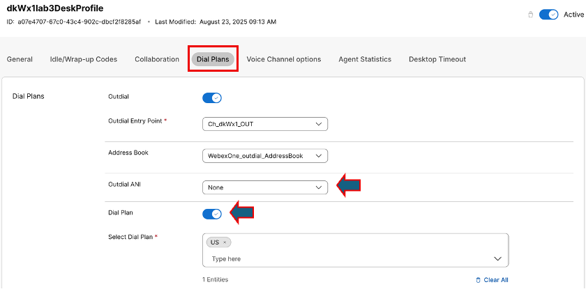{ width="800" }

- Refresh the Agent Desktop application. Click the Outdial option again.

- You should now see the number pad pop up, allowing you to punch in numbers.

- Enter your cell phone number. You may add a "1" before the number, or it will work without it 

- Click the Dial button.

- You should ideally see an agent-initiated call to the cell phone number, but nothing happens.

## Section 3 : Troubleshoot Outdial Failure

- Let's troubleshoot to see why this is the case. 

- To figure this out, bring up the browser developer tool (Shortcut: Press F12 Key).

- Once the developer tool is up, ensure that it's on the "Console" tab and clear the console logs by selecting the "Clear Console" button 

      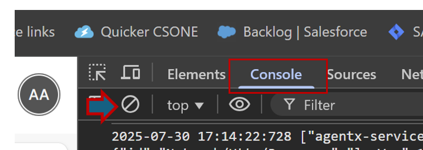{ width="500" }

- Using the dial pad, dial the cell phone number again.

- As soon as the call fails, you should see a red error message in the console logs.

      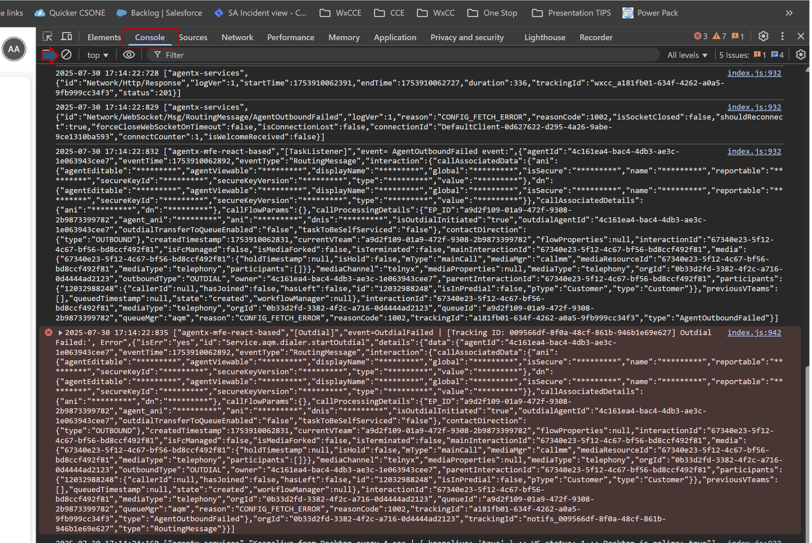{ width="700" }

- Now, let's look closer into the error message and figure out what the issue might be.

- Search for "error," and at the bottom of the error message, you will notice there is a fetch error on "**Config**" – "**Config_fetch_error**." The exact config it's talking about is "**queuemgr**" which basically means queue.

      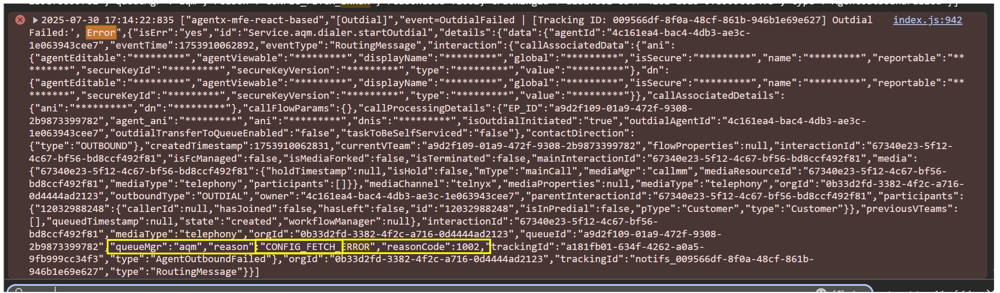{ width="700" }

- This overall means the system is not able to fetch the team details from the queue perspective where agent resides. 

- In WxCC, a queue is always mapped to an entry point via routing flows, so let's go back to the Entry Point for outdial and check the configuration again.

- Via Control Hub, under "Customer Experience," go back via "Channel" to the Outdial Entry Point that was configured.

      { width="200" }

- Under "Entry Point Settings," you will notice that there is no routing flow mapped.

- From the dropdown, select the flow "**WebexOne_OutdialUser[num]_Flow**" and fill in these fields:
      - Music on hold: "defaultmusic_on_hold"
      - Version label: Latest
      - Outdial Queue: Select the queue that was created in step 1 of your initial setup.

- Save the settings.

- From Agent Desktop, perform the outdial to the cell phone number, and now the call should be successful.

- If you observe the browser debug console logs, you should see a message that will clearly show case its fetching the config and have the team details via the queue ID.

## Section 4 : Custom Outdial ANI 

- In many cases, business requirements dictate that the Outdial ANI displayed on customer devices should be set to a specific toll-free or departmental number.

- Here, the outdial ANI noticed on the cell phone is "9842990134" which is the default configuration set on the tenant level.

- To, review the Tenant-Level Outdial ANI setting in tenant Settings navigate to the Voice tab and note the existing Outdial ANI which is 9842990134.

      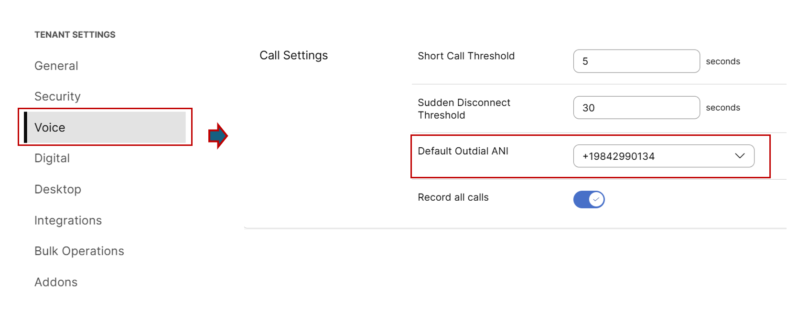{ width="500" }

- To change to a custom ANI, administrator can create there own outdial ANI.

- For ease here outdial ANI has already been pre-configured and to review in Desktop Experience, go to Outdial ANI settings.

      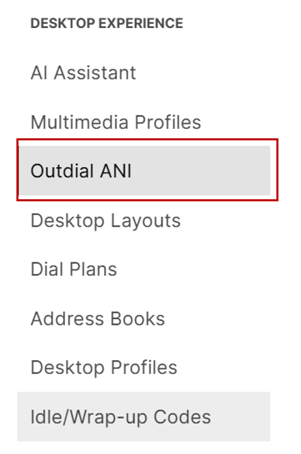{ width="200" }

- Select WebexOne_Outdial_ANI.

      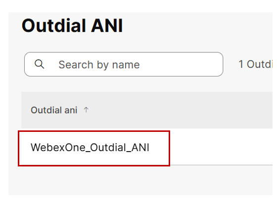{ width="200" }

- Confirm that it is mapped to the number 9842990206.

      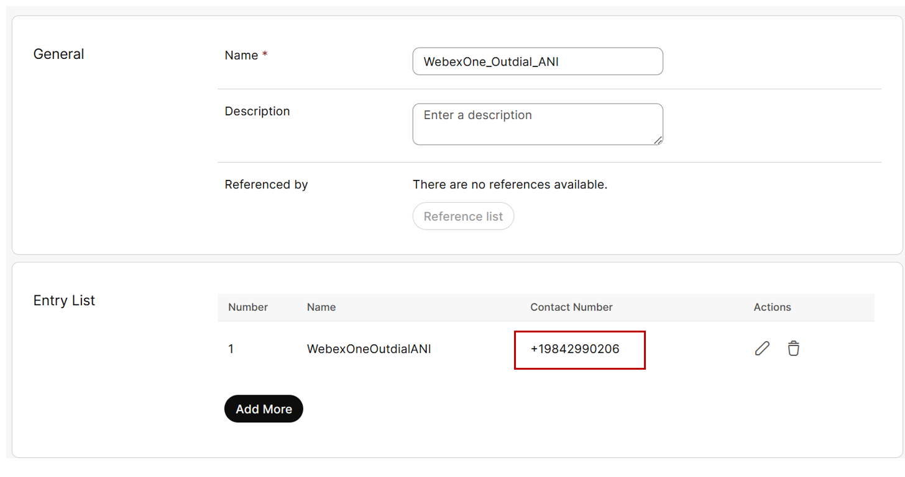{ width="200" }

- A custom Outdial ANI allows an agent to select the ANI on the desktop during an outdial call, provided the agent’s desktop profile is mapped to the new Outdial ANI.

- To check in Desktop Experience, open the configured Agent Desktop Profile.

- Navigate to the Dial Plans section.

- In the Outdial ANI field, select WebexOne_Outdial_ANI and save your changes.

      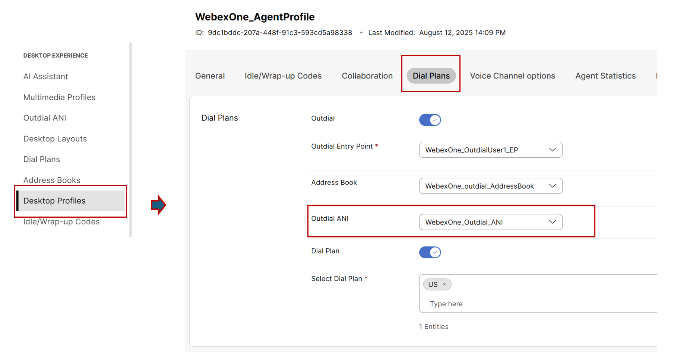{ width="200" }

- Now, Perform an Outdial Call Using the Custom ANI.

- Log in or refresh the agent desktop.

- Initiate an outdial call.

- Verify on the recipient’s device that the displayed ANI is the custom number i.e. 9842990206.

**Congratulations !!** on completing this exercise! 

You've not only set up the outdial feature from scratch but also learned how to identify and fix common errors, ensuring your deployments are both functional and reliable.

