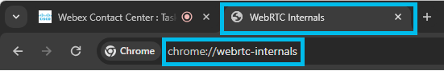
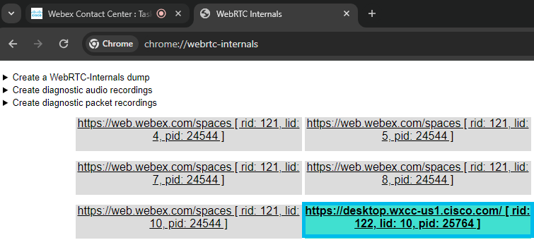
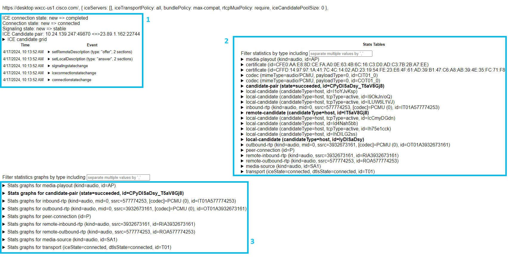
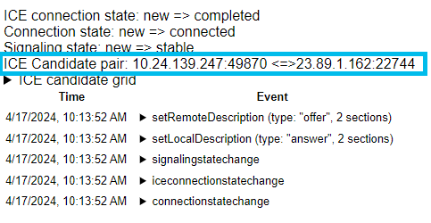
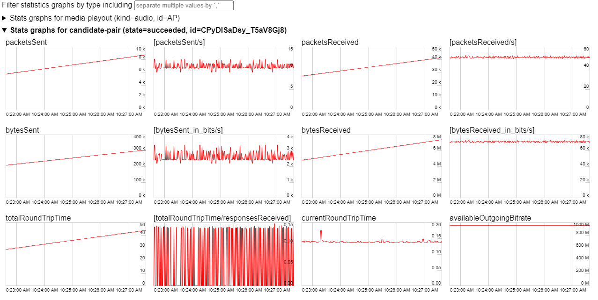
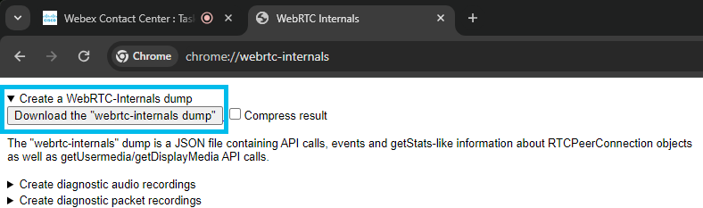
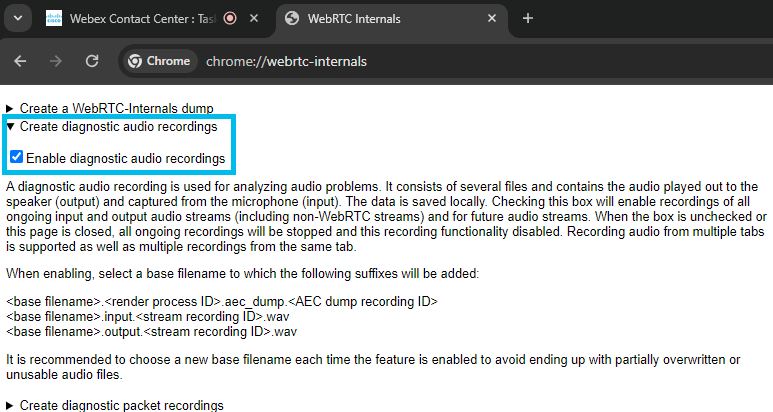
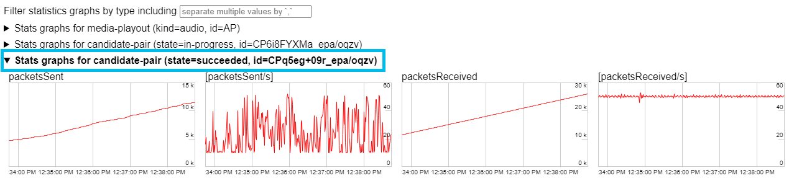
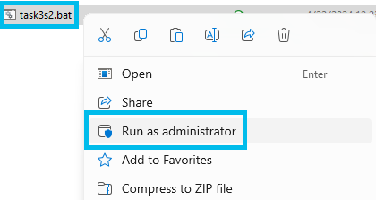
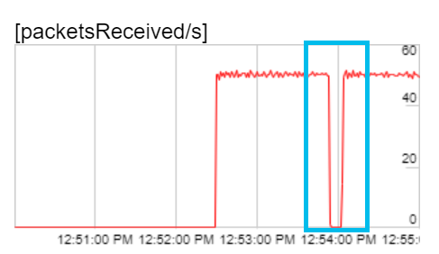

# Task 4 - Exploring WebRTC data and statistics

Please use the following credentials to connect to Control Hub and configure Webex Contact Center:

| <!-- -->         | <!-- -->         |
| ---------------- | ---------------- |
| `Control Hub URL`            | <a href="https://admin.webex.com" target="_blank">https://admin.webex.com</a> |
| `Username`       | labuser**ID**@wx1.wbx.ai _(where **ID** is your assigned pod number; this ID will be provided by your proctor)_ |
| `Password`       | webexONE1! |

!!! info
	This task showcases available WebRTC call data and statistics using built-in browser tools and simulates missing audio during the call.

## Section 1 - Exploring WebRTC internals

- Set your state to **'Available'** on the Agent Desktop.
- Make an inbound call and answer via Agent Desktop when the call is presented.
- Open a new tab in **Google Chrome** web browser.
- Navigate to **chrome://webrtc-internals**.

{ width="600" }

- In the **WebRTC-internals** tab select the active WebRTC session part (**desktop.wxcc-us1.cisco.com** in its name).

{ width="1000" }

- The following information can be seen:
    1. On the left side **(1)**, you'll find a record of the PeerConnection API activities. The RTCPeerConnection is the central interface in the WebRTC API. It represents the connection between the local and remote peer and provides all the functions and events necessary to establish the connection (more details can be found at <a href="https://webrtc.org/getting-started/overview" target="_blank">https://webrtc.org/getting-started/overview</a>). These traces **(1)** display interactions with the RTCPeerConnection object and parameters used.
    2. On the right side **(2)**, you'll find the metrics collected via the getStats API about the current WebRTC connection.
    3. On the bottom **(3)**, you'll find graphs produced by utilizing the getStats API **(2)** about the current WebRTC connection.

{ width="1200" }

- Local and remote IPs and ports in use for this particular WebRTC connection can be seen under traces of the PeerConnection API calls.

{ width="600" }

- Various live call statistics (i.e. sent packets, received packets, latency, dropped packets etc.) related graphs can be seen at the bottom.

{ width="1200" }

- WebRTC log dump can be retrieved by clicking **'Create a WebRTC-Internals dump'** and clicking **'Download the "webrtc-internals dump"** option.

{ width="1200" }

!!! note
    WebRTC log dump file can be parsed and analyzed using specific tools, i.e. [https://fippo.github.io/webrtc-dump-importer](https://fippo.github.io/webrtc-dump-importer)

- WebRTC audio can also be captured for diagnostic purposes.

{ width="1200" }

- End the call.

- Change your state to the idle **'Meeting'** state on the Agent Desktop.

## Section 2 - Investigating missing audio

- Download **task3s2.zip** file from [https://github.com/asuchank/clus24/raw/main/task3s2.zip](https://github.com/asuchank/clus24/raw/main/task3s2.zip) and extract it.

- Make a new call to **+19842906065** using WebRTC via Agent Desktop and press **0** (music should be playing).

- Navigate to **chrome://webrtc-internals** in a new tab.

- In the **WebRTC-internals** tab select the active WebRTC session part (it will have **desktop.wxcc-us1.cisco.com** in its name).

{ width="1000" }

- At the bottom of the **WebRTC-internals** diagnostic page expand bolded text to uncover graphs for an ongoing session.

{ width="1200" }

- Right-click on the **task3s2.bat** file and choose **'Run as administrator'** (audio will be lost for 10 seconds).

{ width="500" }

- Observe **packetsReceived/s** go down to zero on the expanded graph from before.

{ width="500" }

- Based on the observation above - missing audio was caused by the lack of media packets.

- End the call.

- Congratulations, you have completed this task!
